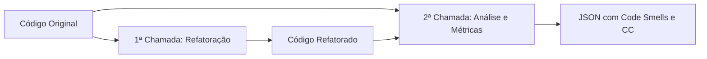

# 🔧  Assistente de Refatoração de Código

<div align="center">


*Um assistente inteligente que utiliza IA para analisar, identificar code smells e refatorar código automaticamente*

</div>

## 📋 Sobre o Projeto

 Um assistente de desenvolvimento que utiliza a Large Language Model (LLM) do Google Gemini para analisar códigos-fonte em qualquer linguagem, identificar Code Smells e aplicar refatorações inteligentes. 

O principal destaque acadêmico é o uso da **Complexidade Ciclomática (CC)**, calculada pela própria LLM, para quantificar a melhoria na qualidade do código de forma objetiva.

### 🎯 Tecnologias Utilizadas

- **Backend**: Python 3.8+ com Flask
- **IA**: Google Gemini 2.0 Flash
- **Frontend**: HTML, CSS, JavaScript
- **Métricas**: Complexidade Ciclomática (CC)

## ✨ Funcionalidades

- 🔍 **Análise de Code Smells**: Identifica e lista os principais problemas estruturais do código
- 🛠️ **Refatoração Automática**: Gera uma versão melhorada e limpa do código original
- 📊 **Cálculo de Complexidade Ciclomática**: Utiliza pipeline de duas chamadas à LLM para calcular CC original e refatorado
- 📈 **Métrica Quantitativa**: Apresenta a melhora percentual na qualidade do código

## 🏗️ Arquitetura

### Pipeline de Duas Chamadas à LLM

Para garantir estabilidade e evitar limite de tokens, o assistente utiliza o modelo Gemini 2.0 Flash em duas etapas:



1. **1ª Chamada (Refatoração)**: Envia o código original e retorna apenas o código refatorado
2. **2ª Chamada (Análise e Métricas)**: Envia ambos os códigos e retorna JSON estruturado com:
   - Code Smells identificados
   - Justificativas das refatorações
   - Valores de CC original e refatorado

## 🚀 Instalação e Configuração

### Pré-requisitos

- Python 3.8+
- Chave de API do Google Gemini (Gemini 2.0 Flash)

### Passos de Instalação

1. **Clone o repositório**
   ```bash
   git clone https://github.com/seu-usuario/GenIA.git
   cd GenIA
   ```

2. **Crie e ative o ambiente virtual**
   ```bash
   python3 -m venv .venv
   source .venv/bin/activate  # Linux/Mac
   # ou
   .venv\Scripts\activate     # Windows
   ```

3. **Instale as dependências**
   ```bash
   pip install -r requirements.txt
   ```

4. **Configure a chave de API**
   
   Crie um arquivo `.env` na raiz do projeto:
   ```env
   GEMINI_API_KEY="SUA_CHAVE_DO_GEMINI_AQUI"
   ```

## 🎮 Como Usar

1. **Execute o servidor Flask**
   ```bash
   python app.py
   ```

2. **Acesse a aplicação**
   
   Abra seu navegador em: `http://127.0.0.1:5000/`

3. **Teste a refatoração**
   - Insira seu código na interface
   - Clique em "Analisar e Refatorar"
   - Visualize o relatório com métricas de CC e código refatorado

## 📁 Estrutura do Projeto

```
GenIA/
├── 📁 front/
│   ├── index.html          # Interface de submissão
│   ├── resultado.html      # Template para o relatório final
│   ├── index.js           # Lógica do frontend
│   └── 📁 static/
│       ├── index.css      # Estilos da página inicial
│       ├── resultado.css  # Estilos da página de resultados
│       ├── resultado.js   # Scripts da página de resultados
│       └── 📁 assets/     # Recursos estáticos
├── 📁 src/
│   ├── __init__.py
│   ├── llm_service.py     # Comunicação com a API Gemini
│   └── code_analyzer.py   # Lógica de negócio e pipeline
├── app.py                 # Ponto de entrada Flask
├── README.md
└── .env                   # Configurações (não versionado)
```

## 🔬 Exemplo de Uso

### Input: Código com Code Smells
```java
public class Calculator {
    public int calculate(int a, int b, String operation) {
        if (operation.equals("add")) {
            return a + b;
        } else if (operation.equals("subtract")) {
            return a - b;
        } else if (operation.equals("multiply")) {
            return a * b;
        } else if (operation.equals("divide")) {
            if (b != 0) {
                return a / b;
            } else {
                return 0;
            }
        }
        return 0;
    }
}
```

### Output: Análise e Refatoração
- **CC Original**: 6
- **CC Refatorado**: 2
- **Melhoria**: 67% de redução na complexidade
- **Code Smells**: Long Method, Switch Statement
- **Código Refatorado**: Implementação com Strategy Pattern

## 🤝 Contribuindo

1. Fork o projeto
2. Crie uma branch para sua feature (`git checkout -b feature/AmazingFeature`)
3. Commit suas mudanças (`git commit -m 'Add some AmazingFeature'`)
4. Push para a branch (`git push origin feature/AmazingFeature`)
5. Abra um Pull Request

## 📄 Licença

Este projeto está sob a licença MIT. Veja o arquivo [LICENSE](LICENSE) para mais detalhes.

## 👨‍💻 Autor

**Thiago Melo Pereira**

- GitHub: [@thiagomelopereira](https://github.com/thiagomelo7)
- LinkedIn: [Thiago Melo Pereira](https://linkedin.com/in/thiago-melo-pereira)

## 🙏 Agradecimentos

- Google AI pela API do Gemini
- Comunidade Flask pelo excelente framework
- Pesquisadores em Engenharia de Software pelas métricas de qualidade de código

---

<div align="center">
⭐ Se este projeto te ajudou, considere dar uma estrela!
</div>
